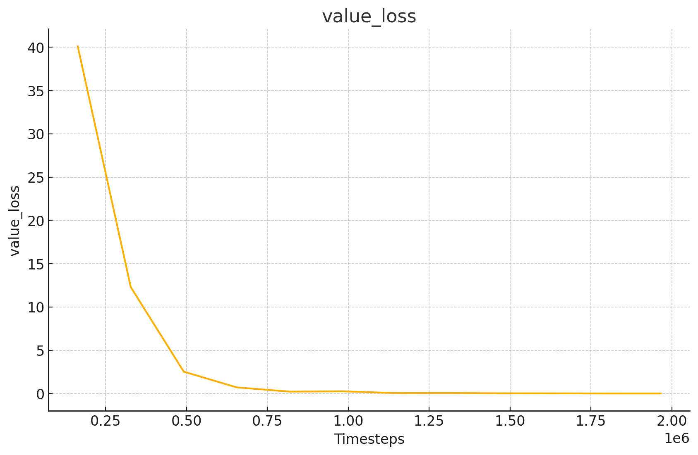
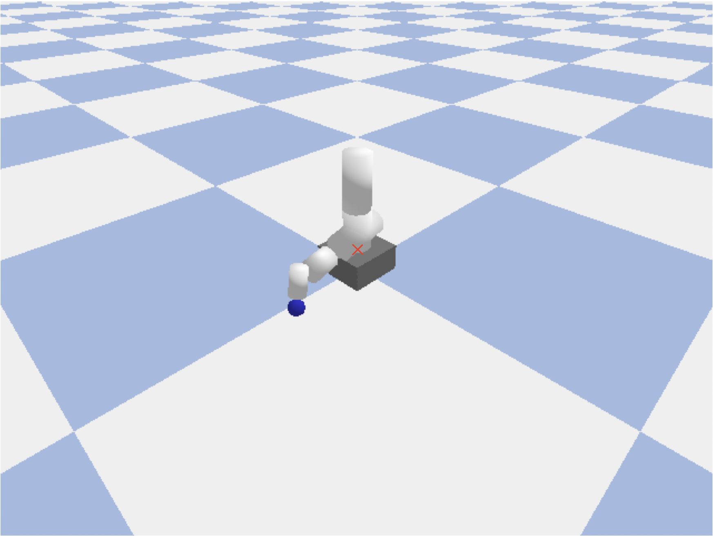
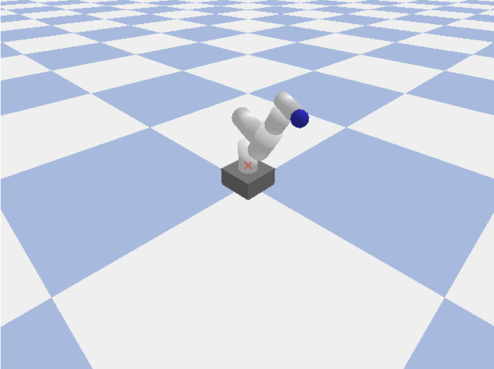
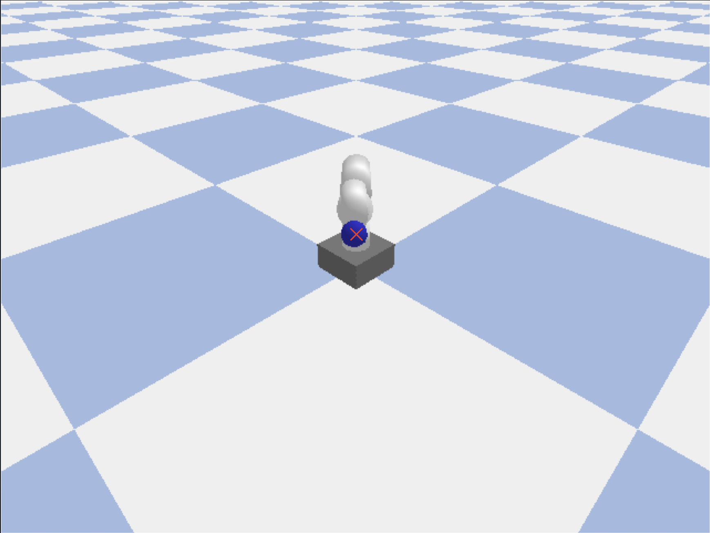
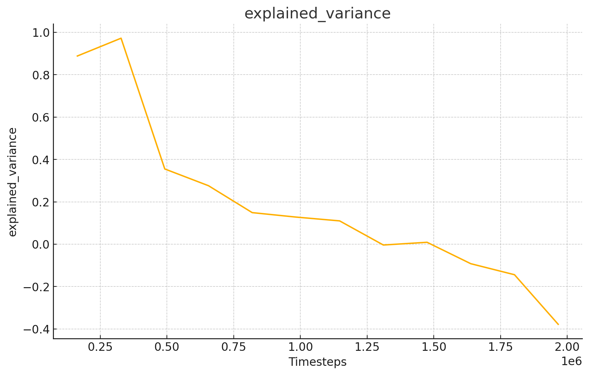
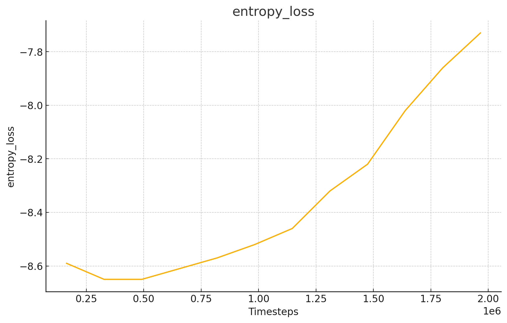
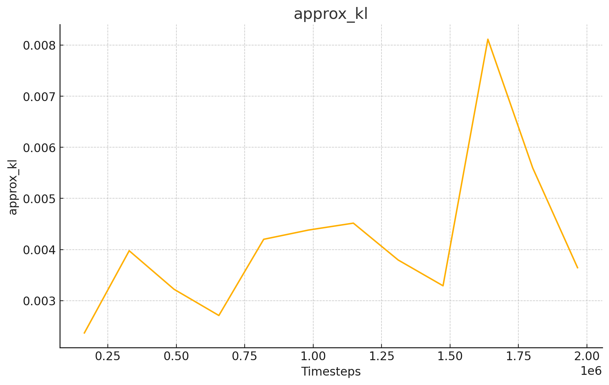

# RL Robot Arm Control

RL project to control a simulated robotic arm using Stable-Baselines3 and a custom Gymnasium environment.

## Overview

This project demonstrates how to train a robotic arm to perform a goal-directed task in a simulated environment using **Proximal Policy Optimization (PPO)**. The robotic arm is simulated using PyBullet,
the custom environment (`envs/robot_arm_env.py`) is built to simulate the UR5 robotic arm, that has for goal to leanr how to move its end effector to a target position. 


The goal of this project was to build a basic robotic simulation environment, learn how to implement RL pipelines using broadly used RL algorithms and get familiar with the training mechanism of an RL model. 

## Features

- **Custom Environment**: Implements a Gymnasium-compatible environment for the UR5 robotic arm.
- **Reinforcement Learning**: Uses PPO from Stable-Baselines3 to train the agent.
- **Simulation**: Powered by PyBullet for realistic physics-based simulation.
- **Visualization**: Training metrics are logged to TensorBoard for real-time monitoring.

## Requirements

- Python 3.8+
- `gymnasium`
- `numpy`
- `torch`
- `stable-baselines3`
- `pybullet`


Install dependencies:

```bash
pip install -r requirements.txt
```

## How to Train

To train the agent (in headless mode):

```bash
python main_RL_headless.py
```

This will:
1. Initialize the custom robotic arm environment.
2. Train the PPO agent for **2,500,000 timesteps**. (Much more efficient with accelerated compute)
3. Save the trained model as `ppo_robot_arm.zip`.

You can monitor the training process using TensorBoard:

```bash
tensorboard --logdir=ppo_robot_tensorboard/
```

## Custom Environment

The custom environment (`robot_arm_env.py`) simulates the UR5 robotic arm for the Gymnasium interface. It includes:
- **`reset()`**: Resets the environment to its initial state.
- **`step(action)`**: Applies an action, advances the simulation, and returns the new state, reward, and done flag.
- **`observation_space`**: Defines the state space (joint positions and velocities).
- **`action_space`**: Defines the action space (joint target positions).

### Reward Function
The reward is based on the distance between the end effector and the target position. The closer the end effector is to the target, the higher the reward.

### Done Condition
The episode ends when the end effector is within **5 cm** of the target position.


## Results

### Metrics


- **Value Loss**  
  Started very high (around 40) and rapidly declined to small value (< 0.1) for the rest of the training.  
  Shows that the agent converged to a strategy to reach the target position.  
  

  This is reflected in the screenshots below — from the middle of the training onwards, the robot consistently reaches the red cross:

<table>
  <tr>
    <td align="center">
      <br/>
      <small>Step 300,000</small>
    </td>
    <td align="center">
      <br/>
      <small>Step 750,000</small>
    </td>
    <td align="center">
      <br/>
      <small>Step 1,600,000</small>
    </td>
  </tr>
</table>

  
- **Explained Variance**  
  The explained_variance started high (~0.97), indicating that early on, the agent's return (cumulative reward onwards) predictions closely tracked the actual return.  
  Over time, it gradually declined and became negative. In this context, where the robot consistently succeeds in reaching the target, the return becomes nearly constant across episodes.  
  As a result, there is little variability left for the value network to explain, explaining the drop in explained_variance.  
  

- **Entropy Loss**  
  Entropy loss being the negative of entropy, it measures how random a policy is.  
  The less negative, the more deterministic the policy.  
  During training, entropy_loss gradually increased from –8.65 to –7.73, showing that the agent moved from broad exploration toward confident, consistent action selection.  
  

- **Approximate KL**  
  Stayed below 0.01 all along, indicates stable training.  
  

  ## Notes

- The PPO policy used is `"MlpPolicy"` (multi-layer perceptron).
- You can adjust `TOTAL_TIMESTEPS` in [`main_RL.py`](main_RL.py) to train the agent for a longer duration.
- The environment uses PyBullet for physics simulation, and inertial data has been added to the URDF file for stability.
- `KMP_DUPLICATE_LIB_OK` is set to avoid library loading issues on macOS systems.
- A PyBullet-GUI version (`main_RL.py`) is included in the run_scripts folder but isn't fully developped.


## Future Improvements

- Add support for more complex tasks like obstacle avoidance or trajectory following.
- Implement curriculum learning to gradually increase task difficulty.
- Finish the GUI version.
- Implement vectorized training, I tried and it caused persistent errors.

## License


**MIT License**.
